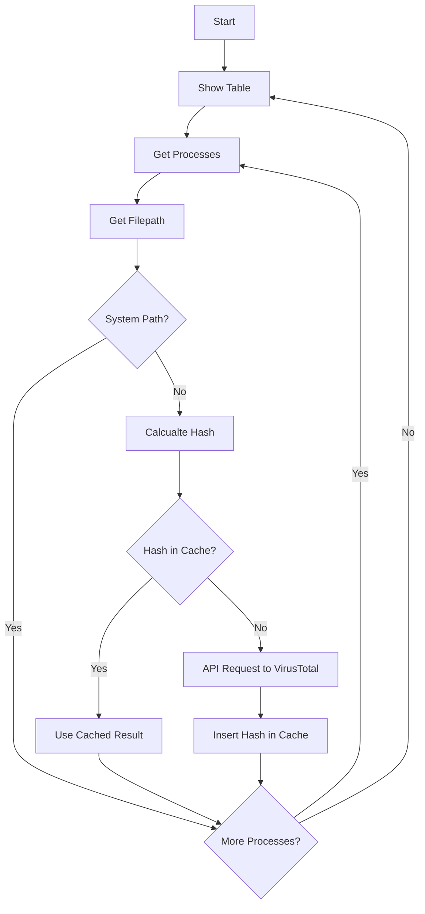

# OS Project 3 - Proc Blart: Mallware Cop

###  Real-Time Process Monitor with VirusTotal Check

## Flowchart

```mermaid
flowchart TD
    A[Start] --> B[Show Table]
    B --> C[Get Processes]
    C --> D[Get Filepath]
    D --> E{System Path?}
    E -->| Yes| F{More Processes?}
    E -->| No| G[Calcualte Hash]
    G --> H{Hash in Cache?}
    H -->| Yes| I[Use Cached Result]
    I --> F
    H -->| No| J[API Request to VirusTotal]
    J --> K[Insert Hash in Cache]
    K --> F
    F -->| Yes| C
    F -->| No| B
```