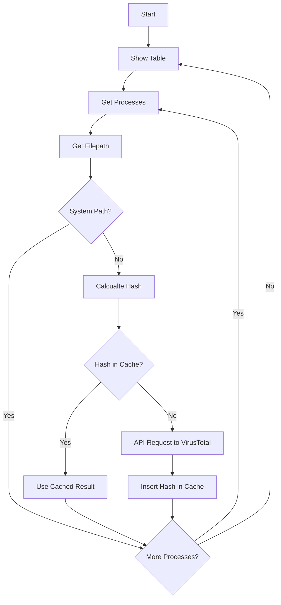

# OS Project 3 - Proc Blart: Mallware Cop


##  Real-Time Process Monitor with VirusTotal Check


## Flowchart


## Testfiles
To create .exe-testfiles I used pyinstaller.
You can make your own.
First install pyinstaller
```
pip install pyinstaller
```
and now you can run
```
pyinstaller --onefile filename.py
```
it creates a build and a dist folder, the exe will be stored in dist/

### virus.exe
A super simple Python Script which does nothing else then wait.

```
pyinstaller --onefile virus.py
```

### memhog.exe
A super simple Python Script which does nothing else then
- create an empty array
- start a while true
- append for each loop a string of 1.000.000 space-chars to the array ~1MB
- when the array reaches a size of 500 MB it stops to fill it
```
pyinstaller --onefile --hidden-import psutil memhog.py
```

### badhash.exe
Similar to virus.exe but this file prozess get filtered by name and becomes the hash value from the EICAR testfile.
```
pyinstaller --onefile badhash.py
```